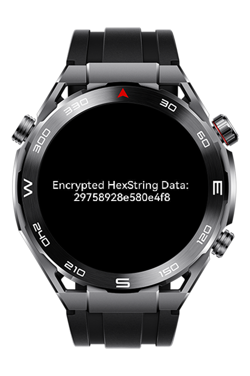

> **Note:** To access all shared projects, get information about environment setup, and view other guides, please visit [Explore-In-HMOS-Wearable Index](https://github.com/Explore-In-HMOS-Wearable/hmos-index).

# AES Decryption Demo using HUKS with (Sport)Lite Wearable
A HarmonyOS demo showcasing secure AES decryption using HUKS framework

# Preview
<div style="display: flex; gap: 5px;">
  
</div>

# Use Cases
- Secure decryption of encrypted byte arrays using AES CTR 128 NoPadding
- Cryptographic key import and secure session management via HUKS
- Data conversion between `Uint8Array` and text formats

# Tech Stack
- **Languages**:  JavaScript (Huawei LiteWearable)
- **Tools**: Huawei DevEco Studio IDE 5.1.1.840
- **Libraries**: [`@ohos.security.huks`](https://developer.huawei.com/consumer/en/doc/harmonyos-references/js-apis-huks)

# Directory Structure
```
entry/src/main/js/MainAbility
├───i18n
│       en-US.json
│       zh-CN.json
├───pages
│       Index.js // Core cryptographic logic using HUKS 
│       Index.hml // UI layout 
│       Index.css // Styling
└─── 
```

# Constraints and Restrictions
## Supported Devices
- Huawei Sport (Lite) Watch GT 4/5
- Huawei Sport (Lite) GT4/5 Pro
- Huawei Sport (Lite) Fit 3/4
- Huawei Sport (Lite) D2
- Huawei Sport (Lite) Ultimate

# LICENSE
**AES Decryption Demo** is distributed under the terms of the MIT License. See the [LICENSE](LICENSE) file for more information.